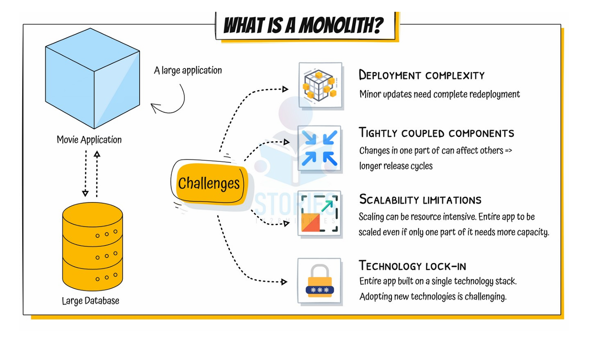
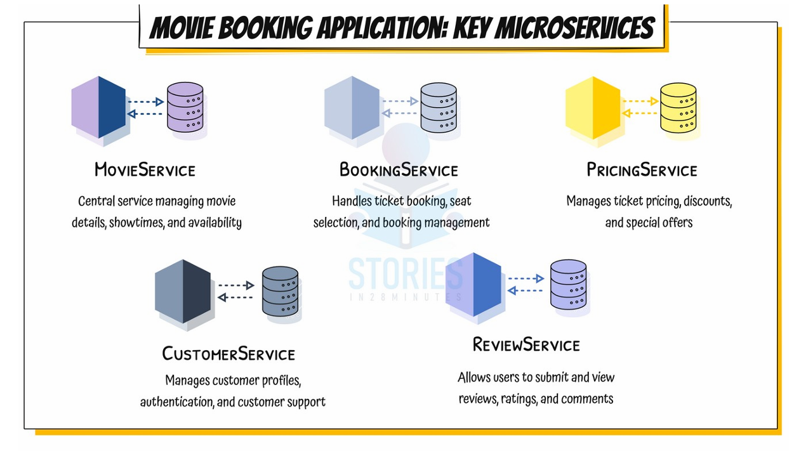

## Monolithic Architecture
- A monolithic architecture is a single, large application where:
  - All features are built into one codebase
  - It is deployed as one unit
  - It usually connects to one large shared database

### Challenges
1. Deployment complexity
   - Minor updates need complete redeployment
   - Even a small change (like fixing booking logic) requires:
     - Rebuilding whole app
     - Testing whole app
     - Redeploying whole app
   - This slows release cycles
2. Tightly Coupled Components
   - Changes in one part affects others
   - Modules depend heavily on each other.
   - Examples
     - Booking service directly calls payment logic internally
     - Changing payment logic might break booking
   - This increases:
     - Bugs
     - Regression issues
     - Longer release cycles
3. Scalability limitations
   - Entire app must scale even one part needs more capacity.
   - If only booking module gets heavy traffic:
     - You cannot scale only booking
     - You must scale entire application
   - This wastes:
     - CPU
     - Memory
     - Infrastructure cost
4. Technology lock-in
    - Entire app built on a single technology stack
    - If the app is built in:
      - Java + Spring + MySQL
    - You cannot easily:
      - Rewrite only payment in Node.js
      - Use MongoDB for catalog
    - Everything must follow same stack

### When Monolithic is Actually good
- It is good for:
  - Simple applications
  - Faster initial deployment
  - Easier debugging (everything in one place)

## Microservice Architecture
- Microservices architecture is an approach where a single application is built as a suite of small, independently deployable services, each:
  - Focused on a specific business capability 
  - Running in its own process 
  - Communicating via lightweight mechanisms (usually REST/HTTP)
  - Independently deployable 
  - Possibly written in different languages 
  - Using different data storage technologies
- Three Critical focus areas in Microservices
  - REST-Based APIs
  - Small, Well-Chosen Deployable Units
    - Each microservice:
      - Has a single responsibility
      - Is independently deployable 
      - Owns its own data 
      - Can evolve without affecting others
  - Dynamic Scaling
    - Each service:
      - Can scale independently
      - Can scale up/down based on load
      - Avoids scaling entire system unnecessarily
      - Example:
        - Payment service high load → scale only payment
        - Catalog service low load → no scaling required
### Advantages
- New technology and process adaption
  - Teams can adopt new technologies and processes for individual services
    - Flexibility - Choose the best frameworks and languages for each service
    - Innovation - Easier to experiment and use emerging technologies
- Dynamic scaling
  - Enable scaling of individual components based on demand
    - Efficiency - Scale only the services that need it, reducing costs
- Faster release cycles
  - Smaller, independent services can be developed, tested and deployed more quickly
    - Agility - Allows for more frequent updates and quicker response to market demands

## Key Microservices solutions
1. Spring Boot
   - Enables rapid development of Rest APIs and standalone applications
2. Spring Cloud
   - Umbrella project that provides tools for distributed systems and microservices.
   1. Centralized configuration
      - Problem: Managing configuration across multiple services is difficult
      - Solution: Spring Cloud Config Server
          - Store config in Git repository
          - Services fetch config at startup
          - Supports environment-specific configs
      - Benefits:
          - Single source of truth
          - Easy config updates
          - No redeployment required (with refresh)
   2. Service Discovery
      - Problem: Microservices run on dynamic ports and containers.
      - Solution: Service Registry (e.g., Eureka)
        - Services register themselves
        - Other services discover them dynamically
        - No hardcoded URLs
      - Benefits:
        - Dynamic scaling support
        - Loose coupling
   3. Load Balancing
      - Problem: Multiple instances of same service need traffic distribution.
      - Solution: Client-side or server-side load balancing.
        - In Spring:
          - Spring Cloud LoadBalancer
      - Benefits:
        - Even distribution of requests
        - Improved reliability
        - Better performance
   4. Edge Server (API Gateway)
      - Purpose: Single entry point for all client requests.
      - Example: Spring Cloud Gateway
      - Responsibilities:
        - Routing
        - Authentication
        - Rate limiting
        - Logging
        - Request filtering
      - Benefits:
        - Centralized cross-cutting concerns
        - Simplifies client interaction
   5. Distributed Tracing
      - Problem: Request flows across multiple services.
      - Solution: Trace requests across microservices.
      - Tools:
        - Zipkin
        - Sleuth (older approach)
        - Micrometer Tracing
      - Benefits:
        - Debugging distributed systems
        - Performance monitoring
        - Bottleneck detection
   6. Fault Tolerance
      - Problem: Failure in one service should not crash entire system.
      - Solution: 
        - Circuit Breaker pattern
        - Retry mechanism
        - Fallback methods
      - Spring Tool: Resilience4j
      - Benefits:
        - Prevent cascading failures
        - Improve system resilience
        - Graceful degradation
3. Docker
   - Purpose: Containerization platform for consistent deployment.
   - Why Important in Microservices?
     - Environment independent
     - Same behavior across dev/test/prod
     - Lightweight compared to VMs
     - Simplifies CI/CD
   - Each microservice:
   - Packaged as a Docker image
   - Runs in its own container
4. Kubernetes
   - Purpose: Container orchestration platform.
   - Responsibilities:
     - Deploy containers
     - Auto-scaling
     - Self-healing
     - Rolling updates
     - Load balancing
     - Service discovery
   - Kubernetes manages thousands of microservice containers efficiently.